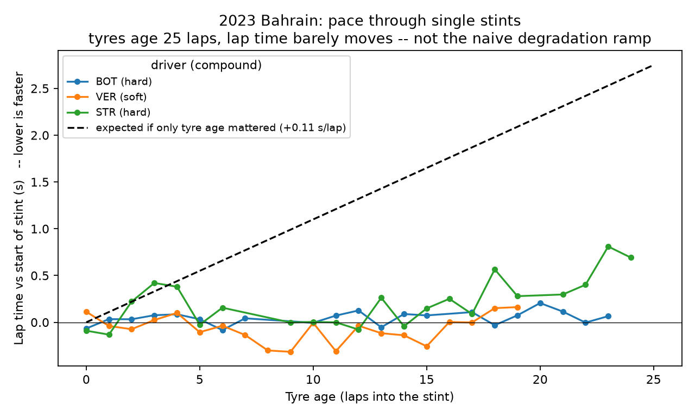
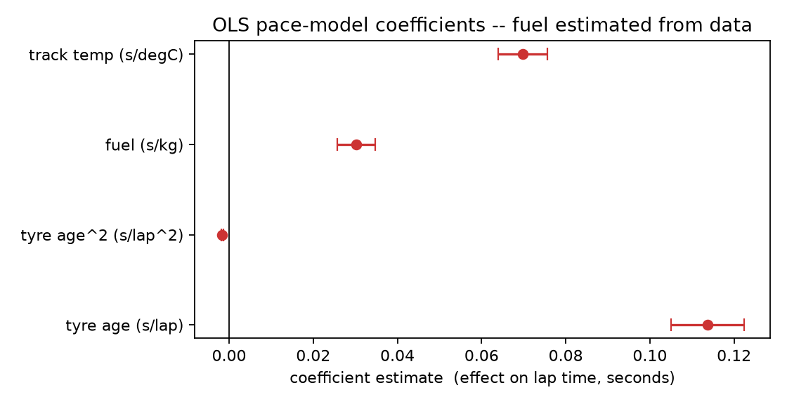
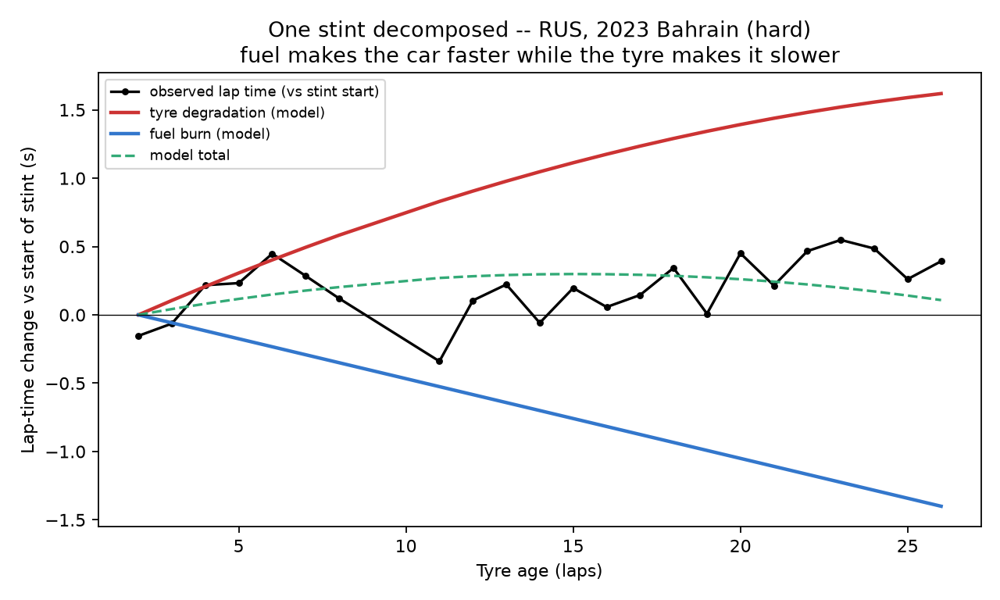
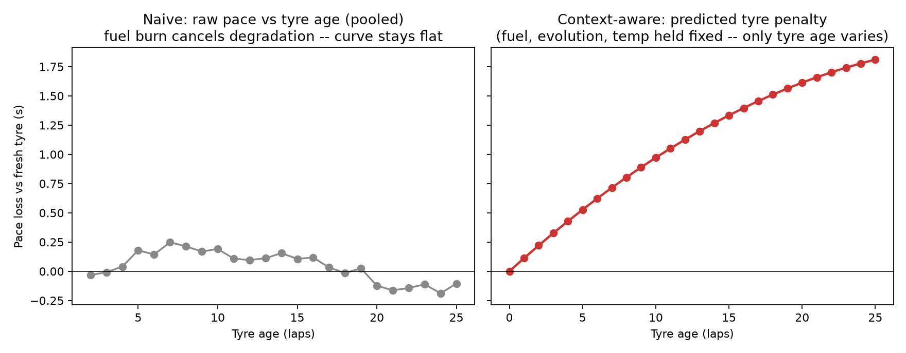
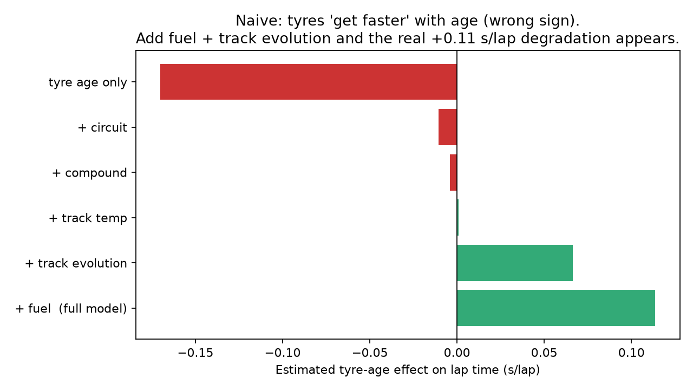
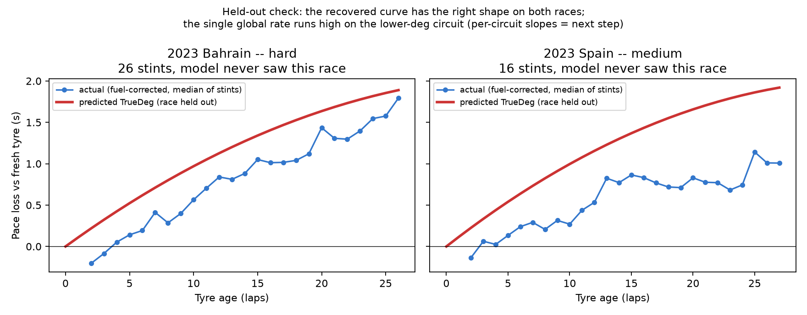
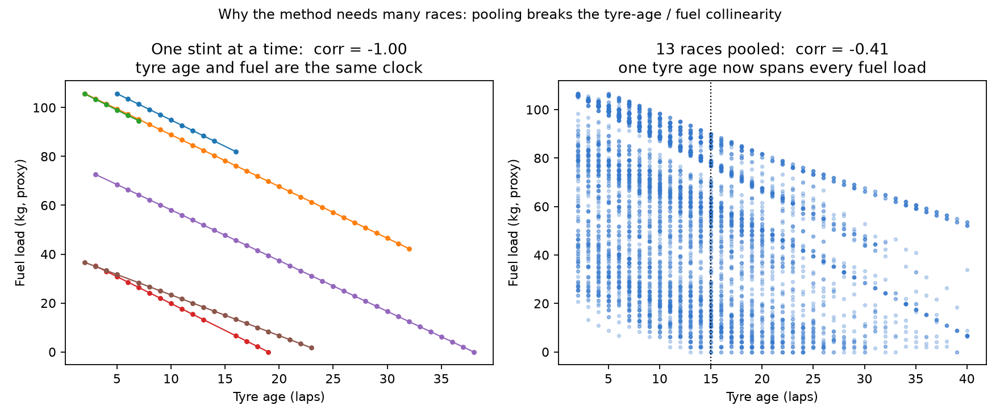

# TRUEDEG

### Estimating True F1 Tyre Degradation from Lap Performance

*TrackShift '26 — AI Motorsport Intelligence*

---

## The position, in one paragraph

We observe a hidden-variable problem in real F1 data: lap time changes through a
stint for many reasons at once, and tyre degradation is only one of them. We
propose a counterfactual approach to isolate the tyre's contribution — model
expected pace from tyre state **plus** its context, then hold the context fixed
and rewind only tyre age. We demonstrate a first version with a simple,
fully-inspectable regression, and we validate whether the recovered curve tracks
tyre behaviour on races the model never saw. This document is the idea
submission; every number below comes from 13 races (2023–2024, 10,381 green dry
racing laps) already in the prototype repo.

---

## Slide 2 — The basic relationship

Lap time is partly a function of tyre health. There is an intuitive chain:

```
TYRE AGE  ->  TYRE HEALTH  ->  LAP PERFORMANCE
```

As a tyre accumulates laps its condition changes, and that changing condition
contributes to the pace the car can produce. If tyre age were a clean stand-in
for tyre health, estimating degradation would be simple: fit lap time against
tyre age and read off the slope.

This is the setup. No machine learning yet.

---

## Slide 3 — But lap time is not just the tyre

Take real stint data and plot lap time against tyre age. The relationship is not
a clean ramp.



Three long, clean stints from the 2023 Bahrain GP. The tyre ages 25 laps; lap
time barely moves. The dashed line is what a pure tyre-age model expects from the
degradation slope we recover later (+0.11 s/lap). The real stints stay flat.

> A tyre can be older while the car gets faster.
> A tyre can be younger while the lap gets slower.

The tyre is ageing **while everything around it changes**:

```
Tyre ageing      -> slower
Fuel burn        -> faster   (car sheds ~100 kg over a race)
Track evolution  -> faster   (rubber goes down, grip comes up)
Temperature      -> changes grip and thermal behaviour
Traffic          -> dirty air, tow, DRS
Driver           -> management, push phases
```

Observed lap time is a mixture of the tyre and everything else happening on the
lap. That is the first real obstacle.

---

## Slide 4 — The actual question

We do not want to answer *"how fast was the lap?"* We want to answer:

> **How much of the lap-time change came from the tyre?**

```
                    OBSERVED LAP TIME
                           |
          +----------------+----------------+
          v                v                v
        TYRE             TRACK             CAR
        age              evolution         fuel
        compound         surface           driver
        stint history    circuit           energy
          |                |                |
          +----------------+----------------+
                           v
                      ENVIRONMENT  (weather, track/air temp)
                           |
                        TRAFFIC   (dirty air, tow, DRS)
```

Tyre degradation is the hidden component we want to isolate — a latent-variable
estimation problem, stated without the jargon.

---

## Slide 5 — What we need to account for

We do not call the other effects "noise". Several of them are meaningful
physical or contextual variables. We group them into layers and model their
effect, so it is not misattributed to the tyre.

| Layer | Variables (proxies available today) |
|---|---|
| **Tyre** | compound, tyre age, stint, tyre history |
| **Car & driver** | fuel-load proxy, driver behaviour, energy/deployment proxies, team/car context |
| **Track** | circuit, track evolution, surface, day/night |
| **Environment** | track temp, air temp, humidity, wind, rain |
| **Race conditions** | traffic, dirty air, tow/DRS, track status |
| **Regulatory context** | regulation era, tyre generation, fuel & energy rules |

> We do not assume these are noise. We model their effect so we do not
> incorrectly attribute it to the tyre.

---

## Slide 6 — Grounded in the sport, not just the data

```
        FIA REGULATIONS
              |
      +-------+-------+
      v       v       v
    TYRES    FUEL   ENERGY
      |       |       |
      +-------+-------+
              v
      operating constraints
              v
      F1 DATA + TELEMETRY
              v
       MODEL INFERENCE
```

- **Regulations** tell us the constraints and technical context the car and
  tyres operate under (mandatory compound sets, fuel-flow and race-fuel limits,
  ERS deployment rules).
- **F1 data** tells us what actually happened lap by lap.
- **The model** estimates the part we cannot directly observe: true tyre
  degradation.

This is also where the 2026 regulation and tyre-generation context belongs —
as framing for what the model must adapt to, not as the project itself.

---

## Slide 7 — From observed performance to TrueDeg

**Step 1 — Learn observed pace.** Fit lap time from tyre state, a fuel proxy,
track evolution, weather, compound and circuit. In the first version this is a
plain linear regression:

```
LapTime ~ C(circuit)                 # circuit fixed effects (absorb the ~20 s
        + TyreLife + TyreLife^2      #   between-track spread)
        + FuelKg                     # fuel effect  (estimated, not assumed)
        + TrackEvoIdx + TrackTemp
        + C(compound)
```

Fit on all 10,381 laps: adjusted R² = 0.982. Every coefficient is inspectable.



| Term | Estimate | 95% CI | Reads as |
|---|---|---|---|
| Tyre age | **+0.114 s/lap** | [0.105, 0.122] | older tyre → slower |
| Tyre age² | −0.0016 s/lap² | [−0.0019, −0.0014] | degradation rate eases slightly with age |
| Fuel | **+0.030 s/kg** | [0.026, 0.035] | heavier car → slower |
| Track temp | +0.070 s/°C | [0.064, 0.076] | hotter track → slower here |

**The fuel coefficient is a check on the method.** `features.py` carries an
independent published rule of thumb of 0.030 s/kg. The regression is given no
fuel information beyond a lap-count proxy and recovers **0.030 s/kg** — ratio to
prior 1.01. The data reproduces a known number we did not feed it.

**Step 2 — Hold the context constant.** For one fixed race context (circuit,
weather, track state, fuel, compound), change only tyre age.

**Step 3 — Compare against a fresh tyre.**

```
Tyre penalty(N) = Predicted pace(N) - Predicted pace(0)
```

This difference is our estimate of tyre-induced performance loss. It is the core
of TrueDeg.



One Bahrain hard stint, decomposed by the fitted model: the tyre adds ~1.6 s of
degradation over 26 laps, fuel burn returns ~1.4 s, and the small residual is
what the stopwatch actually shows. Fuel makes the car faster while the tyre makes
it slower — which is why the raw stint on Slide 3 looked flat.

---

## Slide 8 — The first prediction

Sweep tyre age 0 → N for a fixed context and read off the predicted penalty.
Compare the naive curve with the context-aware curve.



- **Left — naive.** Raw pace vs tyre age, pooled over every stint. It wanders
  around zero and even dips negative: fuel burn cancels degradation, so the
  direct plot says almost nothing.
- **Right — context-aware.** The counterfactual penalty rises cleanly to ~1.8 s
  by lap 25, with fuel, track evolution and temperature held fixed.

The point is not that the naive curve is "wrong noise". It is that the naive
curve answers a different question. Watch the tyre-age coefficient as we add
one control at a time:



| Model | Tyre-age effect |
|---|---|
| tyre age only | **−0.17 s/lap**  (tyres appear to get *faster* — wrong sign) |
| + circuit | −0.011 s/lap |
| + compound | −0.004 s/lap |
| + track temp | +0.001 s/lap |
| + track evolution | +0.066 s/lap |
| + fuel  (full model) | **+0.114 s/lap** |

Fuel burn and track evolution together account for the entire gap between the
wrong-signed naive estimate and the recovered degradation.

---

## Slide 9 — Validating the idea

Refit the model with one race completely held out, predict that race's
degradation curve, and compare it with the actual fuel-corrected stint pace
(median over every fresh stint of that compound).



- **Bahrain 2023, hard (held out):** the recovered curve has the right shape and
  tracks the actual median within ~0.2 s.
- **Spain 2023, medium (held out):** right shape again, but the single global
  degradation rate runs ~0.7 s high on this lower-degradation circuit.

Honest read: a single field-wide rate captures the *shape* of degradation on
unseen races but not yet the *level* on every circuit. Per-circuit and
per-compound slopes are the next iteration, not a claim we make now.

On raw predictive accuracy the interpretable model is deliberately modest — on
absolute lap time, where lap-to-lap variability dominates, the context terms cut
held-out MAE only ~6% (1.51 → 1.43 s). A flexible gradient-boosted model on the
same features, scored on circuit-normalised pace, cuts held-out error **43–47%**
versus the naive tyre-age model (tested both on the rest of each race and on
entirely unseen races). The interpretable model's value is in its coefficients;
the flexible model shows the signal is real and exploitable.

> The scientific test: does a curve learned *after* accounting for context
> explain unseen F1 tyre behaviour better than the naive tyre-age model? On
> shape and on normalised pace error, yes. On absolute per-circuit level, not
> yet.

---

## Slide 10 — Beyond the first model

**Today / this idea.** Structured F1 data (timing, tyres, telemetry, weather,
track, race context) → context-aware model → degradation curve.

**Future.** Add information a lap table does not contain:

```
                TRUEDEG
                   |
      +------------+------------+
      v            v            v
  telemetry      video       pit data
      |            |            |
      +------------+------------+
                   v
             temporal state
                   v
        richer tyre intelligence
```

Video signals worth exploring later: onboard footage, visible locking and
sliding, pit-stop footage, track and weather cues. And on the modelling side:
temporal models (LSTM/GRU) for within-stint state, multimodal fusion, and
physics-informed constraints (PINN-style) so the curve obeys known tyre
behaviour. This is the extension, not the initial claim.

---

## Slide 11 — What TrueDeg enables

From *"how fast?"* to *"why?"*. Once we can estimate the tyre's actual
performance state:

- **Tyre intelligence** — how much performance has the tyre actually lost?
- **Degradation forecasting** — how quickly will it lose more?
- **Driver / car analysis** — is the loss tyre-driven or operational?
- **Condition analysis** — how does the tyre respond to different track and
  weather?
- **Race strategy** — when does the cost of staying out outweigh the cost of
  pitting?
- **Post-race analysis** — what did we predict versus what happened?

---

## The deck in one flow

```
1  tyre age
2  tyre health
3  lap performance
4  but real F1 data doesn't follow this cleanly
5  because everything else changes too
6  map those variables
7  ground them in F1 data + FIA context
8  estimate expected pace
9  virtually rewind tyre age
10 isolate the tyre penalty
11 generate the degradation curve
12 validate against real F1 performance
13 extend to temporal + multimodal + physics-aware
14 race / engineering use cases
```

---

## Appendix — reproducing the numbers

All figures and numbers in this document are produced by the prototype repo:

```bash
.venv/bin/python -m src.build_dataset      # FastF1 -> data/stints.parquet (13 races)
.venv/bin/python -m src.experiments        # exploratory figures (exp0-exp6)
.venv/bin/python -m src.regression         # OLS coefficients, fuel-prior check, slope progression
.venv/bin/python -m src.deck_figures       # the six narrative figures in this doc
.venv/bin/python -m src.model              # flexible-model ablation (supporting evidence)
```

**Data.** 13 races, 2023–2024. Five circuits (Bahrain, Spain, Silverstone,
Monza, Suzuka) appear in both seasons; Jeddah, Monaco and Las Vegas are
single-season generalisation hold-outs. 10,381 laps after keeping green, dry,
racing laps and removing in/out laps and per-stint outliers.

**Known limitations, stated up front.**

- `FuelKg` is a lap-count proxy scaled to a published 0.03 s/kg rule of thumb,
  not a measurement. The model calibrates around it; we do not claim to know the
  fuel load.
- Within a single stint, tyre age and fuel load are perfectly collinear
  (correlation −1.00 — both are linear in lap number). Only pooling stints that
  start at different race laps breaks this (pooled correlation −0.41), which is
  why the method needs many races, not one.

  

- Track evolution is not separately identified once fuel is in the model (wide
  CI spanning zero); its effect on the slope progression is real but its point
  estimate is not reliable on this dataset.
- A single global degradation rate over-predicts on low-degradation circuits
  (Slide 9). Per-circuit / per-compound slopes are future work.
- `Position` is a coarse dirty-air proxy until gap/interval telemetry is loaded.
